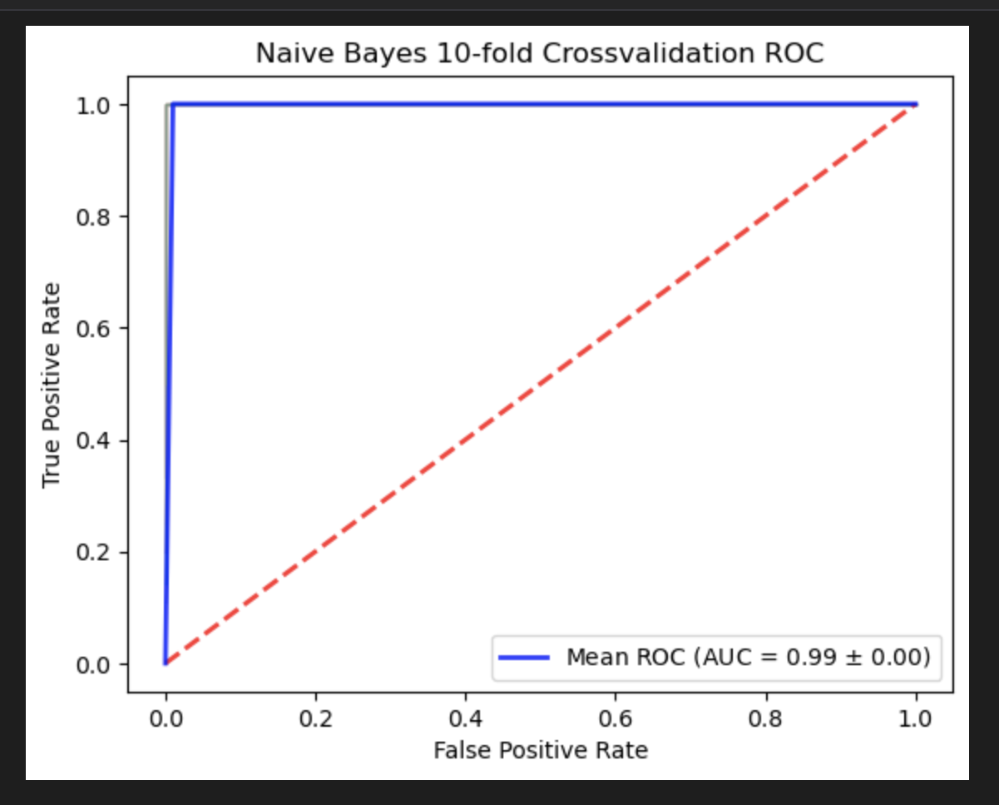
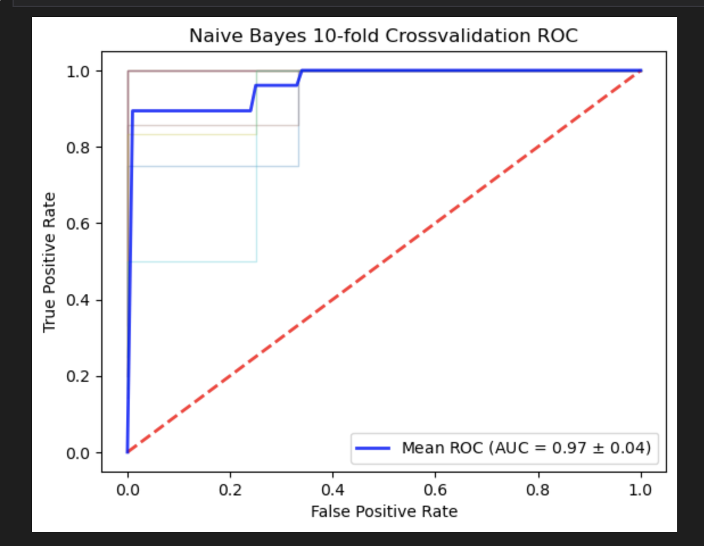
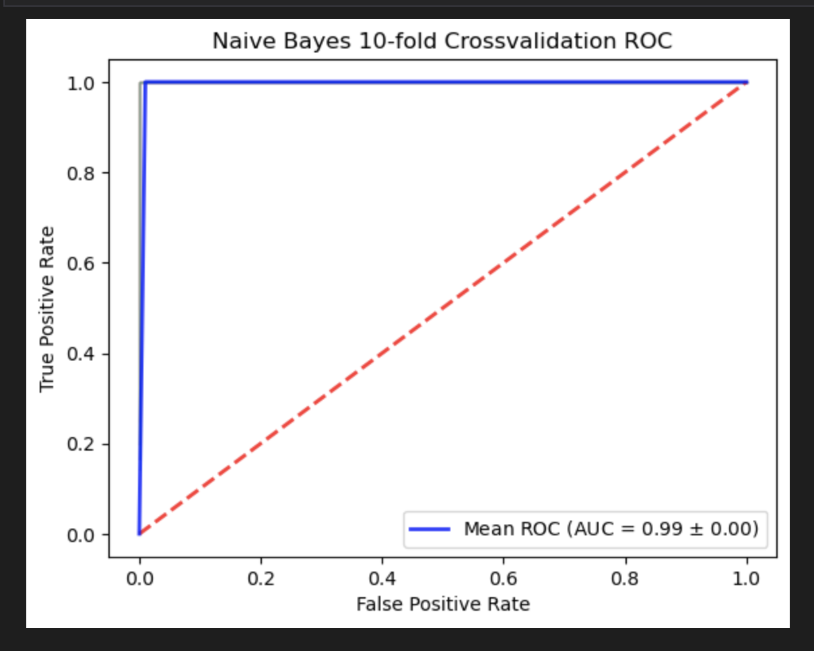

# Naive-Bayes

Naive Bayes Classifier | 10-Fold Cross-Validation | ROC Curve Analysis | Machine Learning | Python

## Overview
This repo contains a Jupyter Notebook that implements the **Gaussian Naïve Bayes algorithm** from scratch to perform binary classification on the famous **Iris dataset 🌸**. The dataset consists of three types of iris flowers: *Setosa*, *Versicolor,* and *Virginica*. 


<!-- Custom CSS for Styling -->
<style>
  h1, h2, h3 {
    color:rgb(143, 166, 189);
  }
  code {
    background-color: #f3f3f3;
    padding: 2px 5px;
    border-radius: 5px;
  }
  /* pre {
    background-color: #f3f3f3;
    padding: 10px;
    border-radius: 5px;
  } */
  table {
    width: 100%;
    border-collapse: collapse;
  }
  th, td {
    padding: 10px;
    border: 1px solid #ddd;
  }
  th {
    background-color: #3498db;
    color: white;
  }
  .image-pair {
    display: flex;
    padding: 10px;
    margin: 40px 10px;
    width: 600px;
    height: 550px
  }
</style>


## Table of Contents
- [File Structure 📂](#file-structure-📂)
- [Requirements](#requirements)
- [Installation Guide 🛠](#installation-guide-🛠)
- [Dataset Information](#dataset-information-📊)
- [Naïve Bayes Algorithm](#naïve-bayes-algorithm-🧠)
- [Display 📷](#display-📷)
- [Key Findings 📈](#key-findings-📈)
- [Contributing 🚀](#contributing-🚀)


```bash
📦 Naive-Bayes repo
|-- 📜 Img 
|    |-- 📜 1.png
|    |-- 📜 2.png
|    |-- 📜 3.png
│-- 📜 Naive_Bayes.ipynb       # Jupyter Notebook with implementation
│-- 📜 requirements.txt        # List of dependencies
│-- 📜 iris.csv                # Dataset (Iris Flower Dataset)
│-- 📜 README.md               # Project documentation

```
## Requirements
- **Python Version**: 3.10 or higher
- **External Dependencies**: Managed through `requirements.txt`
- **Jupter Notebook** for the web framework
- **Numpy** 
- **Panda** 

## Installation Guide 🛠

Follow the steps below to set up and run the project:

### 1️⃣ Clone the Repository
```bash
git clone https://github.com/adexoxo13/Naive-Bayes.git
cd Naive-Bayes
```

### 2️⃣ Create a Virtual Environment (Optional but Recommended)

```bash
conda create --name <my-env>
# When conda asks you to proceed, type y:
proceed ([y]/n)?  

#Verify that the new environment was installed correctly:
conda env list

#Activate the new environment:
conda activate myenv
```

### 3️⃣ Install Dependencies
```bash
pip install -r requirements.txt
```

### 4️⃣ Launch Jupyter Notebook
```bash
jupyter notebook
```
Open `Naive_Bayes.ipynb` in Jupyter and run the cells to see the model in action.

---

## Dataset Information 📊 

The **Iris Dataset** consists of 150 samples, with the following attributes:

| Feature        | Description                    |
|----------------|--------------------------------|
| Sepal Length   | Length of the sepal (cm)       |
| Sepal Width    | Width of the sepal (cm)        |
| Petal Length   | Length of the petal (cm)       |
| Petal Width    | Width of the petal (cm)        |
| Species        | Type of Iris Flower (Target)   |

---

## Naïve Bayes Algorithm 🧠

Naïve Bayes is a probabilistic classifier based on **Bayes' Theorem**. It is widely used for text classification, spam filtering, and medical diagnosis. Given an input feature set, it calculates the probability of each class and selects the one with the highest probability.

### Bayes' Theorem:

- P(A|B) = (P(B|A) * P(A)) / P(B)

---

## Display 📷

📌 **Data Visualization:**
```python
# Example Plot
import seaborn as sns
import matplotlib.pyplot as plt
sns.pairplot(data, hue="species")
plt.show()
```
_This will generate scatter plots of the Iris dataset._

---

## Key Findings 📈 

1. Best Performance:

     Setosa vs Versicolor classifications show near-perfect separation
     <div class="image-pair">
       
     </div>
      
      Setosa vsVirginica classifications show near-perfect separation
      <div class="image-pair">
       
     </div>

     Setosa vsVirginica classifications show near-perfect separation
     <div class="image-pair">
       
     </div>

2. Most Challenging:

     Versicolor vs Virginica classification demonstrates overlap

3. Model Accuracy: 

     Average AUC of 1 for **Setosa vs Versicolor** and **Setosa vs Virginica**
     
     Consistent performance across cross-validation folds
     
     Average AUC of 0.97 ± 0.03 for Versicolor vs Virginica
     


## Limitations
Currently implements Gaussian Naive Bayes only

Assumes feature independence (naive assumption)

Limited to binary classification scenarios

## Future Improvements 🚀
Add multiclass classification support

Implement different probability distributions

Include feature correlation handling

Add hyperparameter tuning capabilities

Expand to other datasets

---

## Contributing 🚀

Contributions are welcome! Feel free to fork the repository and submit a pull request. 


## Contact 📬

Feel free to reach out or connect with me:

- 📧 **Email:** [adenabrehama@gmail.com](mailto:adenabrehama@gmail.com)
- 💼 **LinkedIn:** [linkedin.com/in/aden](https://www.linkedin.com/in/aden-alemayehu-1629aa255)
- 🎨 **CodePen:** [codepen.io/adexoxo](https://codepen.io/adexoxo)

📌 *Star this repository if you found it useful!* ⭐


